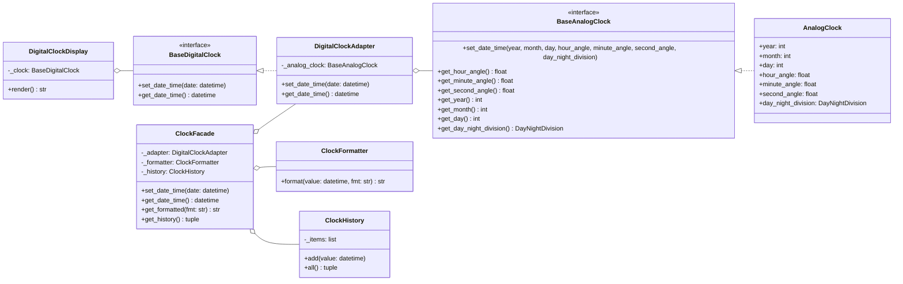

# Структурная диаграмма

```mermaid
classDiagram
    direction LR

    class BaseDigitalClock {
        <<interface>>
        +set_date_time(date: datetime)
        +get_date_time() datetime
    }

    class DigitalClockAdapter {
        -_analog_clock: BaseAnalogClock
        +set_date_time(date: datetime)
        +get_date_time() datetime
    }

    class BaseAnalogClock {
        <<interface>>
        +set_date_time(year, month, day, hour_angle, minute_angle, second_angle, day_night_division)
        +get_hour_angle() float
        +get_minute_angle() float
        +get_second_angle() float
        +get_year() int
        +get_month() int
        +get_day() int
        +get_day_night_division() DayNightDivision
    }

    class AnalogClock {
        +year: int
        +month: int
        +day: int
        +hour_angle: float
        +minute_angle: float
        +second_angle: float
        +day_night_division: DayNightDivision
    }

    class ClockFacade {
        -_adapter: DigitalClockAdapter
        -_formatter: ClockFormatter
        -_history: ClockHistory
        +set_date_time(date: datetime)
        +get_date_time() datetime
        +get_formatted(fmt: str) str
        +get_history() tuple
    }

    class ClockFormatter {
        +format(value: datetime, fmt: str) str
    }

    class ClockHistory {
        -_items: list
        +add(value: datetime)
        +all() tuple
    }

    class DigitalClockDisplay {
        -_clock: BaseDigitalClock
        +render() str
    }

    BaseDigitalClock <|.. DigitalClockAdapter
    BaseAnalogClock <|.. AnalogClock
    DigitalClockAdapter o-- BaseAnalogClock
    ClockFacade o-- DigitalClockAdapter
    ClockFacade o-- ClockFormatter
    ClockFacade o-- ClockHistory
    DigitalClockDisplay o-- BaseDigitalClock
```
